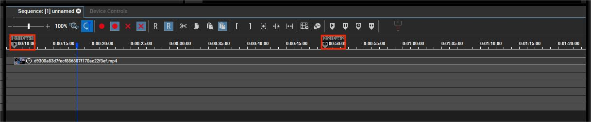
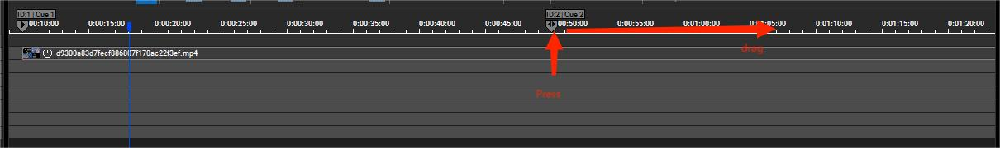

# AVPStudio
杜比影院动态视听走廊显示内容制作工具。

## 简介
部分杜比影院在影厅入口处建设有动态视听走廊系统。该系统使用由科视数字系统公司（Christie Digital）研发的科视Christie® 潘多拉魔盒®系列媒体和显示控制系统，使用多个超短焦投影仪投影多个相邻画面并进行几何校正与边缘融合，实现在白墙上呈现出一个颇具沉浸感的长画面，以在观众进入影厅前营造观影氛围。

制作适配于科视Christie® 潘多拉魔盒®系统的内容需要使用由科视数字系统公司研发的专业内容创建软件及相关工具。遗憾的是，这些工具售价昂贵且授权门槛较高，不适合于观影活动等DIY目的应用。然而，杜比影院所使用的潘多拉魔盒®软件已经预设好了一种画面分离模板，我们只需参照该模板就可以选择制作一种特殊排列规格的视频并将其添加至潘多拉魔盒®时间线，即可产生近似于杜比官方内容的沉浸式显示效果。

AVPStudio是一个编码工具。它可以将任意视频按照该预设的分离模板重新排列并编码为潘多拉魔盒®系统所支持的格式，从而实现自制动态视听走廊的播放内容，在观影活动等需要投影自制内容的情况下应用。

## 使用说明

### 素材准备
杜比影院动态视听走廊具有三种不同的规格。三种规格的具体参数如下：

|规格|尺寸|分辨率|音频轨道|
|---|---|---|---|
|Small|5.5m x 2.1m|2830W x 1080H|7.1 PCM Surround|
|Medium|9m x 2.1m|4633W x 1080H|7.1 PCM Surround|
|Large|12m x 2.1m|6167W x 1080H|7.1 PCM Surround|

有关目标影院的具体规格，可向影院工作人员咨询。若对方无法透露准确信息，可自行对实际投影区域进行测量。

确认规格后，请以目标规格的分辨率制作内容视频。务必留意：

- 根据默认配置，视频将自动循环播放。故请考虑好首尾衔接。
- 影片长度不可过长。
- 请制作常见的普通规格SDR视频，并控制码率在合理范围内。建议考虑使用CBR。不要尝试制作高规格内容，可能会面临不兼容问题。
- 音频声道最高为7.1声道。5.1或立体声也会受到支持。
- 尽可能调低音频音量。否则会影响影厅内观影体验。

### 转换操作
- 启动AVPStudio，选择您的目标影院的走廊尺寸，单击“创建内容”。
- 拖放您制作好的目标规格的分辨率视频到程序窗口中，或单击“浏览”选择视频文件。
- 播放并预览画面效果，在右侧“输出设置”中确认必要的设置。
- 单击“导出放映内容”，等待程序运行完成。
- 联系影院技术人员，将生成的```.mxl```视频文件及```.wav```音频文件拷贝进影院潘多拉魔盒®系统，并按与添加杜比官方内容相同的方法将内容拖入时间线。

### 我的内容未播放完毕即自动跳转回到了开头播放，怎么办？
请仔细观察潘多拉魔盒®系统的时间线，留意图中所框出的两个“cue”标记：



您的视频将从“”标记开始播放，播放至“”即自动返回“”标记处循环播放。您可以按住并拖动“”标记来调整它的位置。如图所示：



这样，通过将“”拉至更远的位置（甚至视频末尾），即可让循环（cue）持续时间更长以避免中途返回开头。

## 技术信息

### 原理说明
有关实现的具体原理及画面结构，请参阅[此专栏](https://www.bilibili.com/read/cv27334455/)。

### 构建说明
截至目前，软件仅在Windows环境下调试并测试通过，尚未针对Linux及macOS环境进行配置。

Windows环境下，请您在开始构建前提前编译ffmpeg库，或在[gyan.dev](https://www.gyan.dev/ffmpeg/builds/)等地下载预构建好的版本。

在项目中新建```external/ffmpeg```文件夹，并将构建好的ffmpeg库拷贝到该文件夹中。确保其链接库（```.dll.a```；```.lib```等）可以在```external/ffmpeg/lib```下被查找到。

构建需要完整的Qt6环境。项目必须使用以下Qt库：Qt6Core, Qt6Widgets, Qt6Multimedia, Qt6MultimediaWidgets。

## 致谢与声明

AVPStudio的诞生离不开[@筱理_Rize](https://space.bilibili.com/3848521/)先生的探索结果。本软件的所有实现原理均由@筱理_Rize先生经沟通及自行测试与活动经验得出。

AVPStudio需要致谢[@冷小鸢aque](https://space.bilibili.com/27063907/)和[@讓晚風温暖各位的心](https://space.bilibili.com/122957742/)在实践中得出的测试结论。

更多致谢信息，请参阅软件的“关于”页面。

杜比®、杜比影院®、Dolby®、Dolby Cinema®是杜比实验室国际有限公司的注册商标。

Christie®、Christie Pandoras Box®是科视数字系统有限公司的商标。

所有其它商标皆为各自所有者的财产。

AVPStudio与杜比实验室、科视数字系统有限公司无关。AVPStudio的输出不能代表上述企业的产品质量。AVPStudio仅被设计用于UGC内容创作目的，而不可被用于专业内容发行工作。针对专业内容发行需求，请与杜比实验室或科视数字系统有限公司联系。

根据《GNU通用公共许可协议》第十一、十二条，本程序为免费授权，故在适用法律范围内不提供品质担保。除非另作书面声明，版权持有人及其他程序提供者“概”不提供任何显式或隐式的品质担保，品质担保所指包括而不仅限于有经济价值和适合特定用途的保证。全部风险，如程序的质量和性能问题，皆由你承担。若程序出现缺陷，你将承担所有必要的修复和更正服务的费用。除非适用法律或书面协议要求，任何版权持有人或本程序按本协议可能存在的第三方修改和再发布者，都不对你的损失负有责任，包括由于使用或者不能使用本程序造成的任何一般的、特殊的、偶发的或重大的损失（包括而不仅限于数据丢失、数据失真、你或第三方的后续损失、其他程序无法与本程序协同运作），即使那些人声称会对此负责。

## 第三方软件与开放源代码许可

AVPStudio基于Qt许可证使用Qt6技术。

AVPStudio基于LGPLv2.1及GPLv2使用来自[FFmpeg](https://ffmpeg.org/)的软件。

AVPStudio是在[GNU GPLv2](https://www.gnu.org/licenses/old-licenses/gpl-2.0.html#SEC1)下开放源代码的软件。